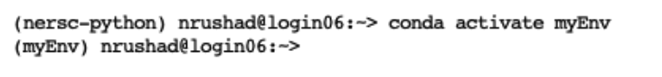
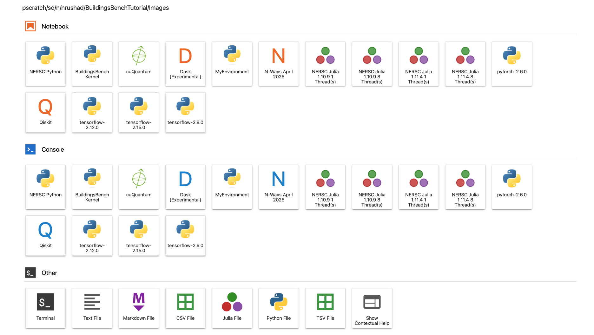

# Develop a Conda Kernel

In this tutorial, you will create a `conda` kernel. Please do not skip this tutorial, as the kernel you create in the final exercise will be required to complete the remaining tutorials and the final project. You will perform all tasks for this section in a terminal—not within this notebook.

To open a terminal:

1) In the notebook interface, click the “+” symbol on the top menu bar to open the Launcher.

2) A new Launcher window will appear—scroll down to the "Other" section and select the "Terminal" icon to launch a terminal session.

We will use `conda` and `pip` to install packages and to create, manage, and update the environment and kernel. To use `conda` and `pip` on Perlmutter, first load the Python module by running `module load python`. Note that this is a SLURM-related command and is outside the scope of this tutorial; it is covered in detail in the `Intro-SLURM` tutorial. Once the module is loaded, you can access `conda` and `pip` by simply typing `conda` or `pip` in the terminal.

## What are conda and pip?

### `conda`

`conda` is a package and environment manager that allows you to install software packages, avoid version conflicts, and manage isolated environments. Below is a list of essential commands needed to create a `conda` kernel for running your tutorials.

| Command                       | Description                     |
|-------------------------------|---------------------------------|
| `conda create`                | Create a new environment        |
| `conda activate`              | Activate the environment        |
| `conda deactivate`            | Deactivate the environment      |
| `conda install`               | Install a package               |

### `pip`

`pip` is the standard package installer for Python. It allows you to install and manage additional libraries and dependencies that are not included in the Python standard library. Below is a list of essential commands for installing and managing packages in your environment.

| Command          | Description                            |
|------------------|----------------------------------------|
| `pip install`    | Installs the specified Python package  |
| `pip uninstall`  | Uninstalls the specified package       |
| `pip show`       | Displays metadata about the package    |

## How to Create a Conda Kernel?

## This section will showcase the essential steps to create a `conda` environment. Please read through this section first and refer to it when completing the exercises. It is important to ensure that the Python module has been loaded before proceeding.

### STEP 1: Create a Conda Environment

This step creates a new `conda` environment named `myEnv` with Python version 3.11:
- `-n myEnv`  specifies the name of the environment.
- `python=3.11` sets the Python version to 3.11.
- `-y` stands for "yes" and automatically confirms all prompts, so you won’t be asked for manual confirmation.

`conda create -n myEnv python=3.11 -y`

### STEP 2: Activate Environmnet

Before installing any packages, make sure to activate your `conda` environment.
- Activate: `conda activate myEnv`
  
The easiest and simplest approach to confirm that your environment is active is to look at your prompt. You will notice `(myEnv)` at the leftmost end of the prompt. This confirms that the environment is successfully activated.

### STEP 3: Install Packages

Install the required packages using both `pip` and `conda` as needed. Some packages are available through `conda` channels, while others may need to be installed via `pip`. 
- Using `pip`: `pip install awscli==1.41.2`
- Using `conda`: `conda install conda-forge::lightgbm`

### STEP 4: Create a conda Kernel

This command registers the `conda` environment as a Jupyter kernel, allowing it to be selected when running notebooks. The `ipykernel` package needs to be installed to successfully run this command:
`python -m ipykernel install --user --name myEnv --display-name MyEnvironment`

- `python -m ipykernel install`: Uses Python to install a new Jupyter kernel through the `ipykernel` module.
- `--user`: Installs the kernel for the current user only, without requiring administrative privileges.
- `--name myEnv`: Enables Jupyter to identify the environment.
- `--display-name MyEnvironment`: Sets the display name that will appear in the Jupyter interface.

### STEP 5: Confirm Kernel Creation
Navigate to the Launcher, refresh Jupyter, and under the Notebook section, the MyEnvironment kernel will be listed.

## Excersice 1: Create `myEnv` Environment 

This exercise shows you how to create your first environment.

Create a `conda` environment named `my1stEnv` with Python version 3.11.

After activating the environment, create a file named `myFirstEnv.py` using the command `vi myFirstEnv.py`. Press `i` to enter insert mode, then type: `print("My First Conda Env")`. Press `Esc`, then type `:wq` to save and exit the editor. Finally, run the script using: `python3 myFirstEnv.py`

Exected Output: `My First Conda Env`

## Excersice 2: Install Python Packages in `my1stEnv` Environment 

Install the following modules:
- `numpy==2.0.0`
- `pandas==2.1.3`

Run the following commands to view module information:

- `pip show numpy`
- `pip show pandas`

Deactivate the `my1stEnv` environment.

## Excersice 3: Create `BuildingsBenchKernel` Kernel

Create a `conda` environment named `BuildingsBenchEnv` with Python version 3.10.

Install the following modules using pip (preferred) or conda if necessary. The versions of numpy and scipy have been intentionally specified—please do not modify them, and do not change the order of installation. Using the latest versions or altering the order may lead to errors. For simplicity, the specific error details are not explained here, but if interested, refer to this document: https://github.com/3dem/relion/issues/1226.

- `numpy==1.26.0`
- `scipy==1.11.2`
- `ipykernel`
- `nbconvert`
- `buildings_bench` 

Please follow these steps to install `buildings_bench`. This will allow installation of the module in editable mode within the `conda` environment.
- `git clone https://github.com/NREL/BuildingsBench.git`
- `cd BuildingsBench`
- `pip install -e ".[benchmark]"`
  
Create a Jupyter kernel named `BuildingsBenchKernel`, and confirm that it appears in the list of available kernels within the Jupyter interface.